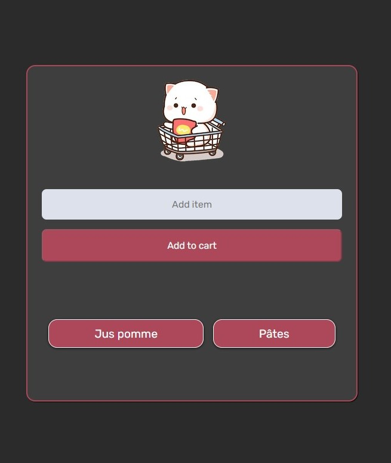

# Scrimba - Build a Mobile App with Firebase

This course helped me to understand how interact with Firebase,
we built this very simple but cool app allowing us to add and to remove values from db.

